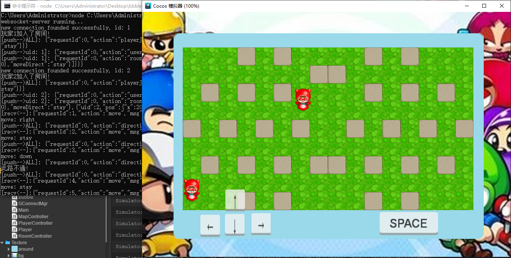

# Bubble
 【CocosCreator】网络版泡泡堂Demo

网络通讯使用WebSocket实现，简单搭建了网络通信框架，目前只实现了玩家在地图里的移动，一个房间支持最多4人加入。
后续可以进行放技能和死亡功能的扩展。

运行方法：
1. 安装CocosCreator，项目是V1.8版本.
2. 安装Node.js，项目用的是V4.4.3版本。
3. 打开命令行，启动服务端："node 项目路径\server\Game.js"。
4. 打开CocosCreator，启动客户端即可，可以分别打开一个模拟器和一个网页端，可以体验联机。

运行截图：

[运行图片](https://img.wenhairu.com/image/Nv7sI)
